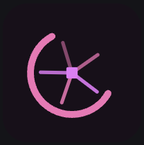

<p align="center">
  <br />
  <sub><code>&lt;GuildGlyph base="guild-glyph" /&gt;</code></sub>
</p>

# guild-glyph

Deterministic avatar glyphs for any slug. No images, no server — pure SVG.

Same input → same glyph, always.

```tsx
import { GuildGlyph } from "guild-glyph";

<GuildGlyph base="arctic-fox" />
<GuildGlyph base="arctic-fox" variant="main-catalog" />
<GuildGlyph base="arctic-fox" animate />
```

## Install

```sh
npm install guild-glyph
```

## Props

| Prop | Type | Default | Description |
|------|------|---------|-------------|
| `base` | `string` | — | **Required.** Slug — always the palette anchor. |
| `variant` | `string` | `undefined` | Variant slug. Renders a visually related but distinct glyph (fg/accent swapped, different layer pool). |
| `size` | `number` | `64` | Width and height in px. |
| `animate` | `boolean` | `false` | Enables idle rotation + hover acceleration. Timing is unique per slug — no two glyphs animate in sync. Waves squiggle, lines march, dots pulse. Respects `prefers-reduced-motion`. |
| `color` | `string` | — | Any valid CSS color (`#hex`, `rgb()`, `hsl()`, `oklch()`, named colors, …). Derives a full palette using OKLCH. Ignored if `palette` is also set. |
| `palette` | `Palette` | — | Full palette override — bypasses hash-selection and `color` derivation entirely. |
| `className` | `string` | — | Class name on the `<svg>` element. |
| `style` | `CSSProperties` | — | Inline styles on the `<svg>` element. |
| `aria-label` | `string` | auto | Defaults to `"{base}"` or `"{base}/{variant}"`. |

## Custom colors

```tsx
// Derive a full palette from any CSS color
<GuildGlyph base="arctic-fox" color="#3ecfb0" />
<GuildGlyph base="arctic-fox" color="oklch(0.7 0.18 160)" />
<GuildGlyph base="arctic-fox" color="tomato" />

// Full manual palette
<GuildGlyph
  base="arctic-fox"
  palette={{ bg: "#111", fg: "#3ecfb0", accent: "#2dd4bf", dim: "#082e28" }}
/>
```

When `color` is provided, the library parses it (any valid CSS color string), converts to OKLCH, and derives `fg`, `accent`, `bg`, and `dim` automatically. Variant glyphs still apply the fg/accent swap so base and variant remain visually distinct.

## How it works

Each glyph is composed from 2–3 shape layers (ring, polygon, cross, dots, brackets, lines, spokes, wave, grid), each driven by an independent RNG stream seeded from FNV-1a hash of the slug. Streams never bleed into each other — this produces thousands of distinct, stable outcomes.

Base and variant glyphs under the same slug share a palette family (12 built-in palettes), but variant glyphs swap fg/accent and draw from a different layer pool so they read as related but distinct.

Animations are shape-aware: waves squiggle via SMIL path morphing, lines march via `stroke-dashoffset`, dots pulse with staggered phases. Rings, polygons, and spokes rotate. Timing is always derived from the hash, so no two glyphs animate in sync.

## Utilities

```ts
import {
  resolveTeamGlyph,
  resolveAppGlyph,
  stringHash,
  PALETTE,
  paletteFromColor,
  cssToOklch,
  oklchToHex,
} from "guild-glyph";

// Raw shape + palette data without rendering
const { shapes, palette } = resolveTeamGlyph("arctic-fox", 64);
const { shapes, palette } = resolveAppGlyph("arctic-fox", "main-catalog", 64);

// FNV-1a hash
const hash = stringHash("arctic-fox"); // → 3012847291

// Derive a palette from any CSS color string
const palette = paletteFromColor("#3ecfb0"); // → { bg, fg, accent, dim }
const palette = paletteFromColor("oklch(0.7 0.18 160)");

// OKLCH conversion
const [L, C, H] = cssToOklch("tomato");   // → [0.63, 0.26, 29.2]
const hex = oklchToHex(0.75, 0.18, 160);  // → "#3ecfb0"
```

## Requirements

- React ≥ 17
- No runtime dependencies

## License

MIT © kd
